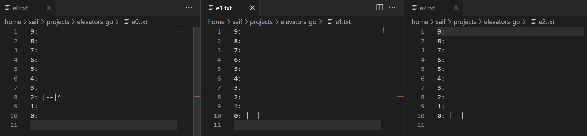

# Quick Start:
```console
go run .
```
Example input to create a call going up from floor 3:
```
3 U
```
Example input to create a call to take **elevator0** to floor 5
```
3 0
```
Output is displayed real-time in files `e0.txt, e1.txt, e2.txt`
